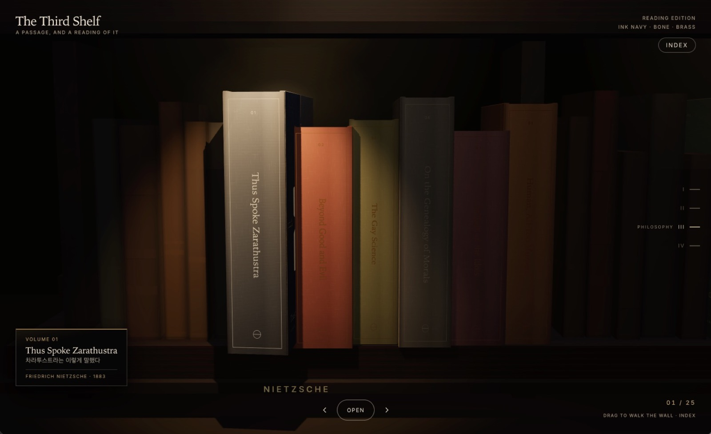
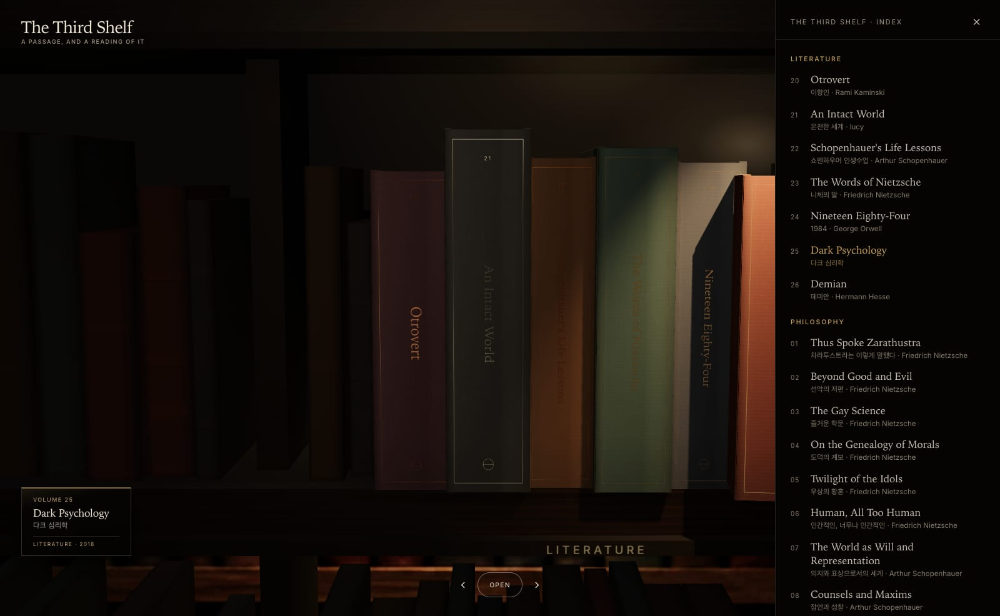
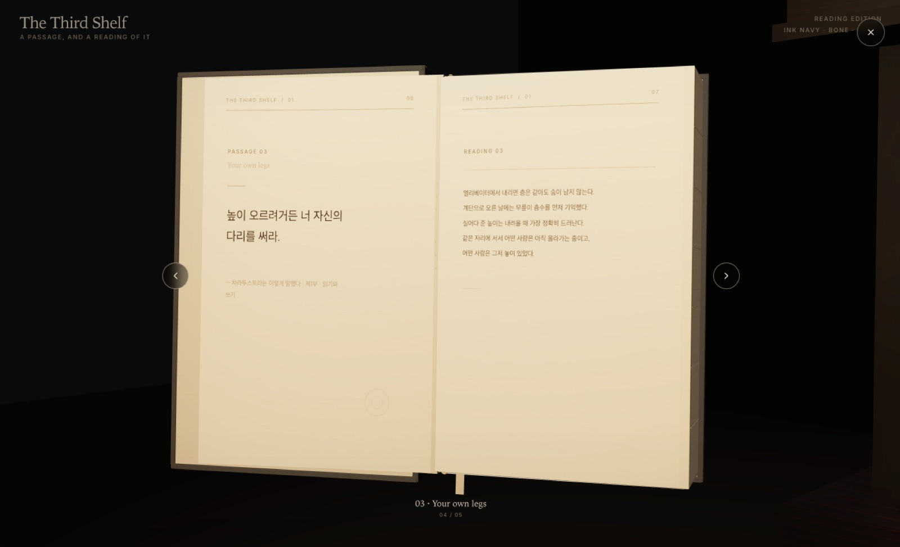

# The Third Shelf

An interactive Three.js library of clothbound volumes. Walk the wall, pull a book into a
responsive detail view, orbit the binding, and drag through physically curved pages.

Every volume is paginated the same way. The left page carries a passage; the right page
carries a reading of it — a short piece of prose written for this edition rather than a
paraphrase of the quotation.

[**Read the build prompt**](PROMPT.md)



## The collection

Twenty-six volumes across five sections. The index panel lists them all; the wall keeps
the literature bay on shelf level I and the philosophy sections on level III.



| Section | Volumes |
| --- | --- |
| Nietzsche | Thus Spoke Zarathustra · Beyond Good and Evil · The Gay Science · On the Genealogy of Morals · Twilight of the Idols · Human, All Too Human |
| Schopenhauer | The World as Will and Representation · Counsels and Maxims · The Wisdom of Life · On the Suffering of the World · The Art of Being Right |
| Stoics | Meditations · On the Shortness of Life · The Enchiridion · Letters from a Stoic |
| Moralists | Essays · Pensées · Maxims · The Art of Worldly Wisdom |
| Literature | Otrovert · An Intact World · Schopenhauer's Life Lessons · The Words of Nietzsche · Nineteen Eighty-Four · Dark Psychology · Demian |

## Passages and readings

Each book carries two or three passages. A passage is a quotation; a reading is the page
facing it.

The readings follow one rule: they do not explain the quotation. They put a scene down
first, let the sentences disagree with each other slightly, and arrive at the meaning a
beat late — so the page can be read once for the image and again for the thought.



```text
사람은 극복되어야 할 그 무엇이다.          ←  passage
                                            차라투스트라는 이렇게 말했다 · 제1부 · 서설

오래 앉아 있던 자리에서 일어설 때,          ←  reading
몸이 잠깐 자기 모양을 기억한다.
굽었던 쪽이 먼저 아프고, 펴는 일은 그다음이다.
극복은 크게 들리는 말이지만
시작은 대개 어제의 자세를 오늘 다시 쓰지 않는 데 있다.
일어선 뒤에도 의자는 그 자리에 그대로 있었다.
```

Passages come from public-domain editions. Where a book is still in copyright, the left
page carries a reader's note written for this edition instead of a quotation, marked
`독서 노트` in its attribution line.

One volume is not built this way. *An Intact World* (온전한 세계) is a single continuous
piece, so its two pages are not two kinds of page — the prose runs off the verso and onto
the recto, and the spread reads as one block of type rather than as a pair. Every page
shares one column, one measure, and one first baseline, which is what keeps an opened
spread from splitting down the gutter. The signature appears once, at the end.

The passages are quoted, so they are unsigned. The readings are authored, so each one is
signed at the foot of its page — `lucy`. The colophon says the same in full.

## What is inside

- A four-bay shelf wall navigated with the wheel, arrow keys, buttons, position markers,
  or the index panel.
- Hardcover construction with separate boards, spine, hinges, endpapers, page block,
  headbands, bookmark, foil, and contact shadows.
- Responsive inspection mode with orbit, pan, zoom, hover-to-crack-open, click-to-open,
  and drag-to-turn page interactions.
- Page count that follows content: a volume with three passages binds eight leaves, one
  with two binds six.
- Page artwork authored at each volume's own sheet aspect, so a leaf's type is never
  stretched to fit a differently proportioned surface.
- A reading mode: opening the cover clears the editorial panel, centres the spread, and
  leaves only close, the two page buttons, and a line of page info. Escape closes the
  book; a second Escape returns it to the shelf.
- Single-page reading on a screen too narrow to hold a spread. The condition is measured
  rather than a breakpoint — it begins exactly where the spread stops fitting — and the
  camera centres one page at a time instead of shrinking both until the prose is too
  small to read. The buttons then step a page; a dragged sheet still turns a whole leaf,
  because that is what the gesture is doing.
- Book-specific color systems that recolor the scene and the editorial detail layout.
- Procedural cloth, foil, paper, page-edge, wood, roughness, normal, and shadow textures.
- Deterministic shelf-to-detail transitions with exact endpoints, so reparenting the
  selected volume never produces a last-frame jump.
- Accessible HTML controls and status announcements layered over the WebGL scene.

## How it is made

The entire experience lives in [`index.html`](index.html): markup, responsive layout,
shaders and materials, book geometry, interaction state, animation, and embedded image
atlases. There is no framework, bundler, backend, or analytics layer.

The render stack uses [Three.js](https://threejs.org/) with physically based materials and
`OrbitControls`. Cover and wood artwork are stored as embedded WebP atlases; page interiors
and surface detail are drawn at runtime with canvas textures. Each book is assembled from
reusable geometry, while the front cover and pages use hinged groups and segmented meshes
for curved page-turn motion.

Interaction is managed as a small state machine:

```text
shelf -> opening detail -> closed inspection -> open book -> closing -> shelf
```

Camera, book, shelf, and view-offset transforms share deterministic eased timelines, which
keeps the animation continuous when a book moves between the shelf and inspection scene
graphs.

## Adding a volume

Volumes are plain data near the top of the module script. Add an entry to `VOLUMES`:

```js
{ id: "montaigne-essays",
  title: "Essays", titleKo: "수상록",
  author: "Michel de Montaigne", discipline: "Moralists", date: "1580",
  note: "What do I know?",
  deck: "One paragraph for the detail panel.",
  passages: [
    { label: "Que sais-je", source: "제2권",
      quote: "나는 무엇을 아는가?",
      reading: [
        "한 줄이 한 행입니다.",
        "줄바꿈이 곧 호흡이라 배열은 그대로 유지됩니다."
      ] }
  ] }
```

`discipline` must match an entry in `CATEGORY_ORDER` (or be `"Literature"` for the lower
bay). Everything else — binding, palette, shelf slot, pagination, spread labels, and the
page-canvas aspect — is derived. A bay holds up to eight volumes.

`reading` is an array because the line breaks are the pacing. The renderer keeps them and
only wraps a line that exceeds the measure.

For a continuous piece, give the volume `prose` instead of `passages` — an array of
paragraphs, each an array of authored lines:

```js
{ id: "reading-intact-world",
  title: "An Intact World", titleKo: "온전한 세계",
  author: "lucy", discipline: "Literature", date: "2026",
  note: "One world, lived to the end.",
  deck: "One paragraph for the detail panel.",
  proseTitle: "Part I",
  prose: [
    ["그는 자신을 불행하다고 느끼지 않았다."],
    ["갖고 싶다는 갈망도,",
     "갖지 못했다는 상실도 없이."]
  ] }
```

The text is flowed across leaves at one line capacity per page, so the page count follows
the writing. A paragraph break becomes a rest; a rest that lands on a page edge is dropped
and the paragraph after it opens the next page, which leaves that page a line short rather
than running two paragraphs together across the turn. The piece is padded to an even count
because a leaf has two sides and an odd count would split a spread. Spreads are labelled
from `proseTitle`, and the detail panel mirrors nothing while reading, since the page is
not facing a quotation.

When a line needs exactly two visual lines — the common case, and the one where a
two-syllable stub on the turnover reads worst — the break moves to the word boundary
nearest the middle. Lines that need three or more fall back to greedy wrapping, where a
short last line is ordinary rather than jarring.

Continuation lines are indented, so they are measured against a smaller budget than the
first. A token with no break point in it — a URL, a long compound — is hard-broken rather
than left to run off the leaf, at grapheme boundaries where `Intl.Segmenter` is available,
which is every browser this page targets. Older engines fall back to an approximation.

The budget is a character count, not a pixel width. That is the unit every page measure
here is tuned in, and it holds for the Korean prose these pages carry, where glyphs are
near enough to one width. A long run of unusually wide glyphs in a proportional face can
still exceed the column while staying inside the count.

## Run locally

The page uses JavaScript modules, so serve it over HTTP instead of opening it from disk:

```bash
python3 -m http.server 4173
```

Then visit [http://localhost:4173](http://localhost:4173).

No install or build step is required. An internet connection is needed for the pinned
Three.js modules and the Inter font.

## Project structure

```text
complete-shelf/
├── index.html       # Complete production experience
├── assets/
│   ├── covers/      # Cover artwork for the literature bay
│   ├── screens/     # Screenshots used in this README
│   └── *.webp       # Backdrop art
├── PROMPT.md        # Portable recreation and remix brief
└── README.md        # Project overview and implementation notes
```

## Credits and scope

The shelf and hardcover construction began from
[The Complete Shelf](https://mengto.github.io/complete-shelf/) by Meng To. This edition
keeps that craft and rebuilds the rest around a different collection, a content-driven
pagination model, and the passage/reading spread.

The visual direction studies the clarity and material craft of contemporary editorial book
publishing, including [Stripe Press](https://press.stripe.com/), while using original
bindings, textures, layouts, and interaction design. This project is independent and is not
affiliated with any publisher named here.
